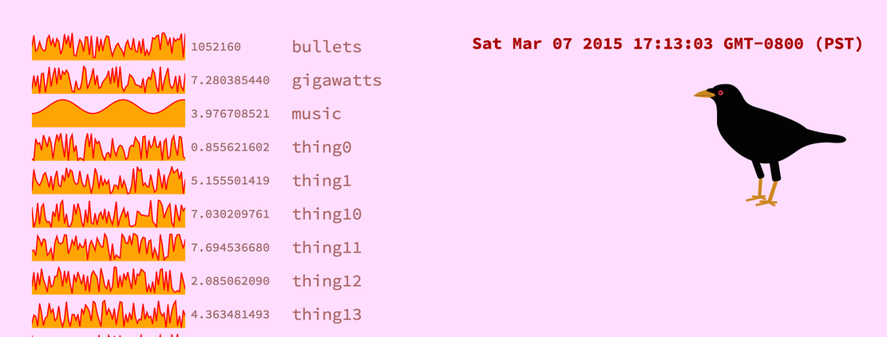

# crow-metrics-viz

Viz is a small plugin for [crow-metrics](https://github.com/robey/crow-metrics) that exposes your server's metrics over HTTP using [express](https://expressjs.com/). It collects snapshots over a rolling window (one hour, by default) and graphs this data on a web page.




## Usage

There are two ways to construct the service:

- `viz(metrics: Metrics, options: VizOptions = {}): express.Router`

  Create an express router that will respond to a path with the viz interface. This is useful if your server is already using express for other requests.

    - `express` - the express module or a compatible one
    - `metrics` - a crow `Metrics` object
    - `options` - passed to the `RingBuffer`:
        - `span: number` - how many milliseconds to buffer (default is one hour, or 3600 * 1000)
        - `prometheus: boolean` - if true, a prometheus document will be hosted at `/metrics`

  For example:

  ```javascript
  const express = require("express");
  const { Metrics } = require("crow-metrics");
  const { viz } = require("crow-metrics-viz");

  const app = express();
  const metrics = Metrics.create();
  app.use("/admin/viz", viz(express, metrics));
  ```

  This will add the viz paths under `/admin/viz` on your express server.

- `startVizServer(metrics: Metrics, port: number = 8080, options: VizOptions = {})`

  Start up the viz site on a devoted port with a new instance of express.

  For example:

  ```javascript
  const { Metrics } = require("crow-metrics");
  const { startVizServer } = require("crow-metrics-viz");

  const metrics = Metrics.create();
  startVizServer(metrics, 9090);
  ```

  This will create a page at `http://localhost:9090/`.


## Paths

- `/`

  A small webpage that loads the content from `/history.json` and draws an SVG graph for each one. This is meant to give a quick human-readable overview of the server instance's metrics.

- `/current.json`

  A JSON object where each key is the name of a metric, and each value is its current value.

- `/history.json`

  A JSON object where each key is the name of a metric, and each value is an array of the metric's values over the past hour (or whatever span you configured), in order from oldest to newest. A special key `"@timestamp"` gives an array of the corresponding timestamps for these values, in epoch seconds.

- `/metrics`

  A prometheus-formatted plaintext metrics snapshot, if requested in `options`.


## License

Apache 2 (open-source) license, included in `LICENSE.txt`.


## Authors

@robey - Robey Pointer <robeypointer@gmail.com>
